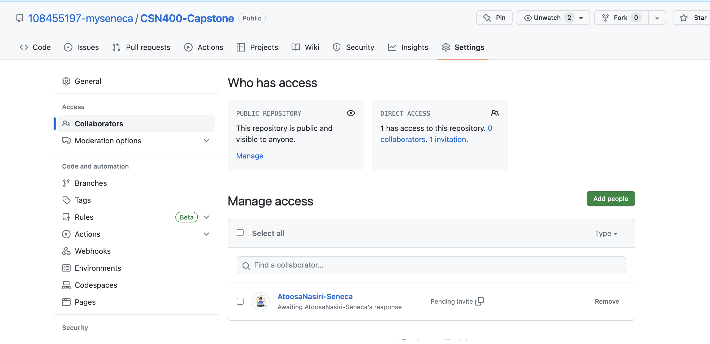

# Checkpoint1 Submission

- **COURSE INFORMATION: CSN400 NCC**
- **STUDENT’S NAME: MAXWELL AYI-BONTE**
- **STUDENT'S NUMBER: 108455197** 
- **GITHUB USER_ID: 108455197-myseneca**
- **TEACHER’S NAME: ATOOSA NASIRI**

## Table of Contents
1. [My Images](#my_image)
2. [Single line code snippet](#single_line_code_snippet)
3. [Multi line code snippet (preferably bash script)](#multi_line_code_snippet_(preferably_bash_script))
4. [Sample `.json` objects](#sample_`.json`_objects)
5. [Sample table](#sample_table)
6. [Sample hyperlink](#sample_hyperlink)

### My Images
A photo of the city of Toronto at night.


A photo of the collaborators.


### Single line code snippet
`echo "Hi, My name is Maxwell"`

### Multi line code snippet (preferably bash script)
```bash
#!/bin/bash

echo "Printing text with newline"
echo -n "Printing text without newline"
echo -e "\nRemoving \t backslash \t characters\n"

```

### Sample `.json` objects
```
{
  "name": "Maxwell",
  "age": 21,
  "city": "Toronto",
  "hobbies": ["sports", "video games"],
}
```

### Sample table
| Cities          | Countries            |
| --------------- | -------------------- |
| Toronto         | Canada               |
| Chicago         | United States        |
| Manchester       | England              |
| Shinjuku City   | Japan                |
